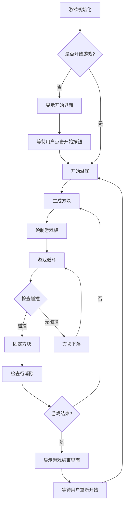
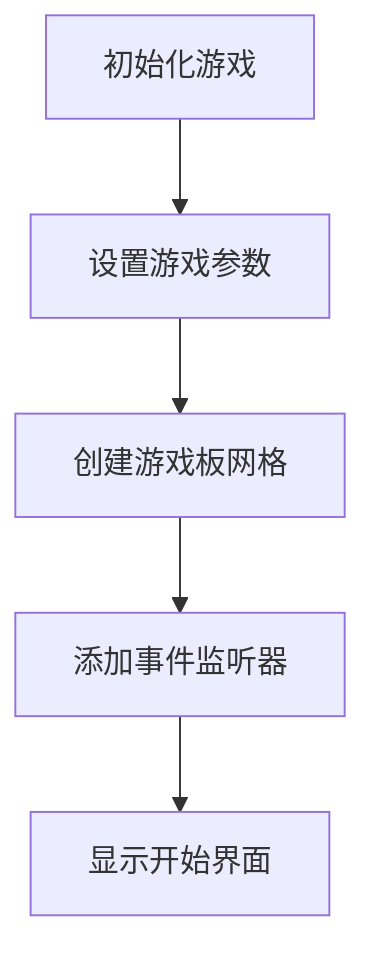
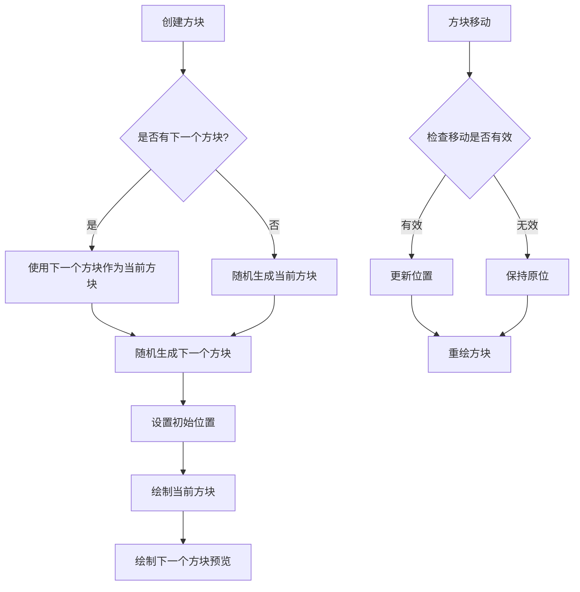
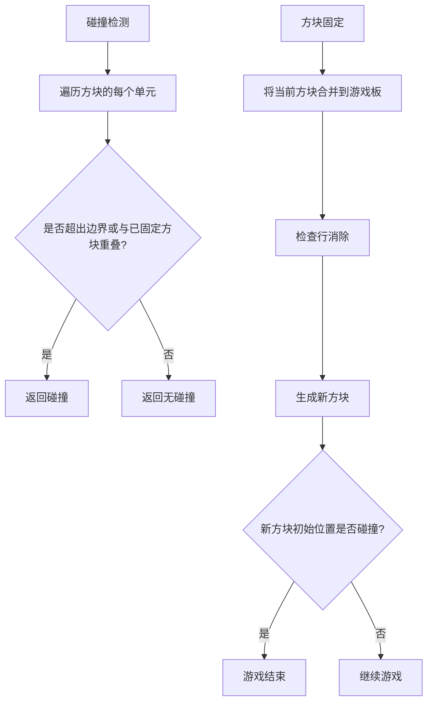
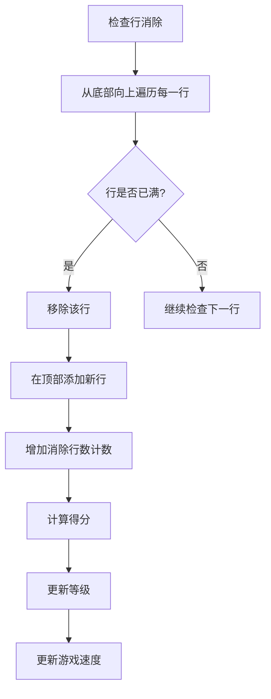
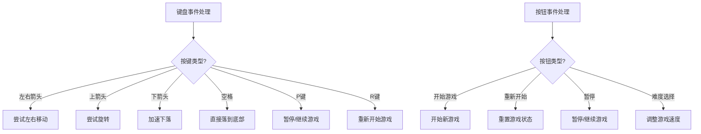
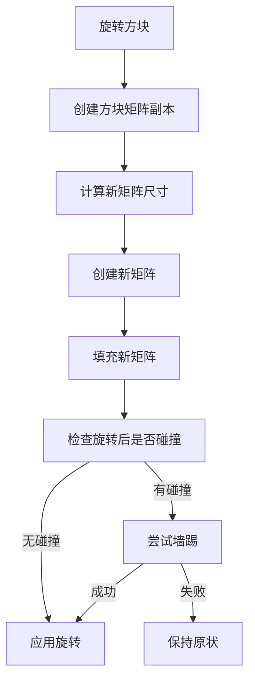
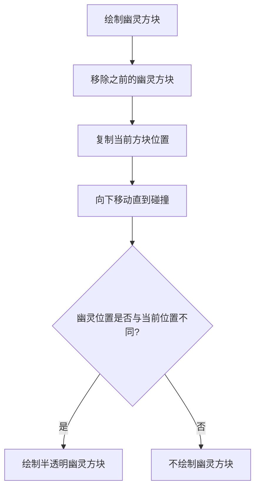
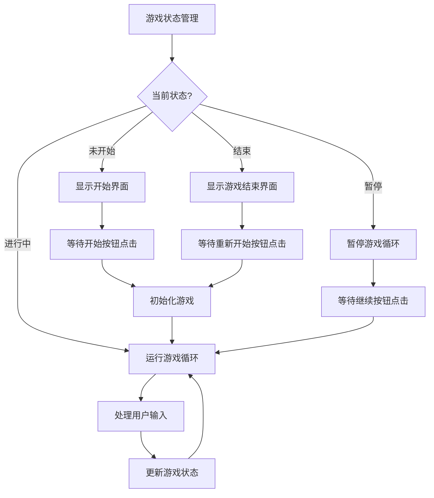

          
# 俄罗斯方块游戏

一个使用纯HTML、CSS和JavaScript实现的现代化俄罗斯方块游戏。

## 游戏概述
俄罗斯方块是一款经典的益智游戏，本实现使用纯HTML、CSS和JavaScript构建，无需任何外部框架或库。游戏保留了经典俄罗斯方块的核心玩法，同时加入了现代界面设计和增强功能。

## 游戏特点

- 🎮 **经典玩法**：包含7种不同形状的方块，通过旋转和移动来消除行
- 👁️ **方块预览**：显示下一个将出现的方块，帮助玩家提前规划
- 👻 **幽灵方块**：显示当前方块落地位置的半透明提示
- 🔢 **分数系统**：根据消除行数计算得分，并显示当前等级
- 🎚️ **难度选择**：提供初级、中级、高级三种难度选择
- 🎛️ **游戏控制**：支持暂停/继续、重新开始功能

## 操作说明

- ← → : 左右移动方块
- ↑ : 旋转方块
- ↓ : 加速方块下落
- 空格 : 方块直接落到底部
- P : 暂停/继续游戏
- R : 重新开始游戏

## 在线体验

🎮 [点击这里在线体验游戏](https://blog.forminio.cn/e-luo-si-fang-kuai)

## 核心实现逻辑

### 数据结构

1. **游戏板网格**：使用二维数组 `boardGrid` 表示游戏板，0表示空白，非0值表示已固定的方块类型
2. **方块形状**：使用 `SHAPES` 数组存储7种不同形状的方块及其类型
3. **当前方块**：使用 `currentShape`、`currentType`、`currentRow`、`currentCol` 跟踪当前活动方块
4. **下一个方块**：使用 `nextShape` 和 `nextType` 存储下一个将出现的方块

### 游戏流程图

### 主要功能模块

#### 1. 游戏初始化

游戏初始化时，设置基本参数（行数、列数、方块大小等），创建游戏板网格，并添加键盘和按钮事件监听器。

#### 2. 方块生成与移动

方块生成时，会随机选择一种形状，并设置初始位置。方块移动时，会先检查移动是否有效（是否会与其他方块或边界碰撞），然后更新位置并重绘。

#### 3. 碰撞检测与方块固定

碰撞检测用于判断方块是否可以移动到指定位置。当方块无法继续下落时，会将其固定到游戏板上，然后检查是否有可消除的行，并生成新的方块。

#### 4. 行消除与分数计算

当一行被方块填满时，该行会被消除，并在顶部添加新的空行。消除行数会影响得分和游戏等级，等级提升会加快方块下落速度。

#### 5. 用户交互

游戏支持键盘和按钮操作，用户可以通过键盘控制方块移动、旋转和加速下落，也可以通过按钮开始、暂停和重新开始游戏，以及选择难度级别。

## 核心功能详解

### 1. 方块旋转算法

方块旋转是通过矩阵转置和行反转实现的：

旋转算法会创建方块矩阵的副本，然后进行90度旋转。如果旋转后的位置发生碰撞，会尝试"墙踢"（wall kick）操作，即尝试向左右移动以适应旋转。

### 2. 幽灵方块实现

幽灵方块是当前方块在不移动的情况下，能够下落到的最低位置的半透明提示：

幽灵方块通过模拟当前方块下落直到碰撞来确定位置，然后在该位置绘制半透明的方块，帮助玩家规划落点。

### 3. 游戏状态管理

游戏状态管理包括开始、暂停、继续和结束状态的处理：

游戏状态管理确保游戏在不同状态下有正确的行为，例如在暂停状态下停止方块下落，在游戏结束状态下显示结束界面等。

## 实现亮点

1. **模块化设计**：游戏逻辑被分解为多个功能模块，如方块生成、碰撞检测、行消除等，使代码结构清晰。

2. **响应式界面**：游戏界面使用CSS实现响应式设计，适配不同屏幕尺寸。

3. **高效渲染**：使用DOM操作而非Canvas绘制，通过只更新变化的部分来提高性能。

4. **增强游戏体验**：添加了幽灵方块、方块预览、难度选择等功能，提升游戏体验。

5. **状态管理**：实现了完整的游戏状态管理，包括开始、暂停、继续和结束状态。

      
